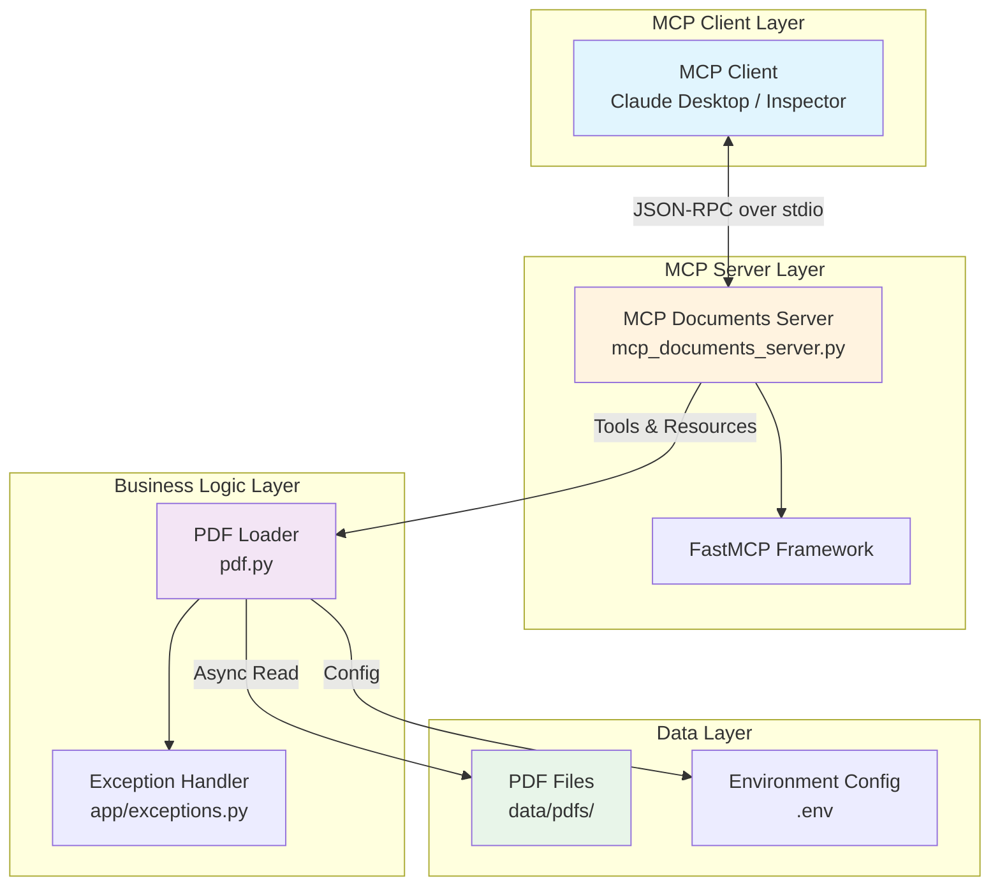
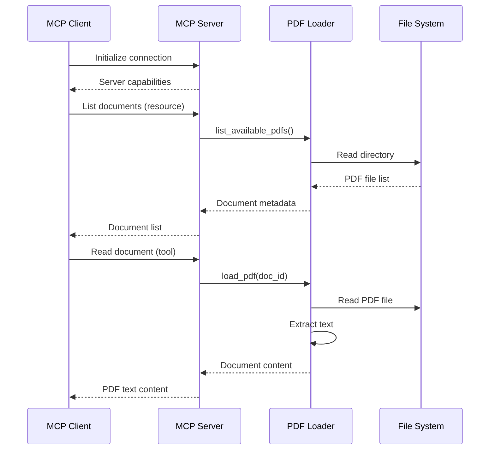

# MCP PDF Extract

A Model Context Protocol (MCP) server that provides PDF document reading capabilities. This server allows MCP clients to list and read PDF documents from a specified directory.

## Architecture



### Component Communication



## Features

- List available PDF documents
- Read and extract text content from PDF files
- File size validation
- Path traversal protection
- Configurable PDF directory and size limits

## Prerequisites

- Python 3.10 or higher
- `uv` package manager (recommended)

## Installation

### 1. Clone the repository

```bash
cd /path/to/your/projects
git clone <repository-url>
cd MCP_pdf_extract
```

### 2. Create virtual environment and install dependencies

Using `uv` (recommended):

```bash
# Install uv if you haven't already
curl -LsSf https://astral.sh/uv/install.sh | sh

# Create virtual environment
uv venv

# Sync dependencies
uv sync
```

### 3. Set up environment variables

Create a `.env` file in the project root:

```bash
MAX_PDF_SIZE_KB=350
PDF_DIR=./data/pdfs
```

### 4. Create PDF directory

```bash
mkdir -p data/pdfs
```

Place your PDF files in the `data/pdfs` directory.

## Running the Server

### Basic execution

```bash
uv run python mcp_documents_server.py
```

### Testing with MCP Inspector

To test the server with the MCP Inspector:

```bash
npx @modelcontextprotocol/inspector
```

In the Inspector interface:
- **Command:** `uv`
- **Arguments:** `run --with mcp mcp run mcp_documents_server.py`

### Verify the server is running

To verify the server is responding correctly, you can send a test message:

```bash
echo '{"jsonrpc": "2.0", "method": "initialize", "params": {"capabilities": {}}, "id": 1}' | uv run python mcp_documents_server.py
```

You should see a JSON response from the server.

## Available Resources and Tools

### Resources

- `docs://documents` - Lists all available PDF documents
- `docs://documents/{doc_id}` - Fetches the content of a specific PDF document

### Tools

- `read_doc_contents` - Reads and returns the text content of a PDF document
  - Parameter: `doc_id` (string) - The filename of the PDF to read

## Configuration

The server can be configured using environment variables:

- `PDF_DIR`: Directory containing PDF files (default: `./data/pdfs`)
- `MAX_PDF_SIZE_KB`: Maximum allowed PDF file size in KB (default: 350)

## Integration with MCP Clients

### Claude Desktop

Add the following to your Claude Desktop configuration file:

**macOS:** `~/Library/Application Support/Claude/claude_desktop_config.json`

```json
{
  "mcpServers": {
    "pdf-extractor": {
      "command": "uv",
      "args": ["--directory", "/path/to/MCP_pdf_extract", "run", "python", "mcp_documents_server.py"],
      "env": {}
    }
  }
}
```

## Troubleshooting

- Ensure Python 3.10+ is installed: `python --version`
- Verify uv is installed: `uv --version`
- Check that PDF files are in the correct directory: `ls data/pdfs/`
- Ensure the virtual environment is activated when running commands

## License

[Your license here]